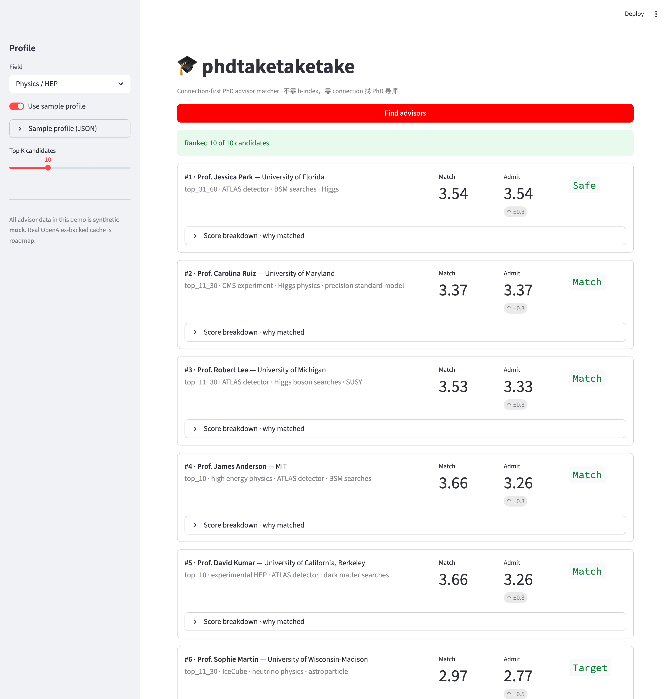

# phdtaketaketake

> **Connection-first PhD advisor matcher** — find the right advisor by network strength, not h-index.

[中文](README.zh.md) · English



---

## Why this exists

Most "find a PhD advisor" tools rank by h-index, citation count, or paper volume. This one ranks by something more honest about how PhD admissions actually work:

- **Network connection** between the candidate advisor and *your current advisor* — co-author graph, academic genealogy, joint collaborations, committee co-membership. The actual mechanism behind admits.
- **Quantified scoring** across 4 dimensions, all on a 4.0 scale (mirroring GPA), then tier-adaptively weighted.

## What it does

**Input**: your undergrad / master institution, GPA, research direction, current research advisor (if any), and publications.

**Output**: ranked candidate PhD advisors at top US programs, with:

- match score (0–4.0)
- admission likelihood (0–4.0) with confidence band
- per-dimension breakdown (Connection, Publication, Experience, GPA)
- explanation of the connection path (e.g., *"your advisor co-authored 4 papers with this PI in the last 5 years"*)

## Quick start

```bash
git clone https://github.com/powerofjinbo/phdtaketaketake.git
cd phdtaketaketake
pip install -e .
streamlit run phd_matcher/app.py
```

A demo profile is preloaded so you can see ranked results immediately. Drop in your own profile JSON to match against the included candidate cache.

CLI also works:

```bash
phd-matcher match --profile data/samples/sample_student_physics.json --field physics --top-k 10
```

## How it differs

|                        | CSrankings        | h-index ranking     | **phdtaketaketake**                         |
| ---------------------- | ----------------- | ------------------- | ------------------------------------------- |
| Data                   | Conf. paper count | Citation count      | Co-author graph + genealogy + multi-dim     |
| Personalized           | ❌                | ❌                  | ✅ student profile → candidate advisor       |
| Connection-first       | ❌                | ❌                  | ✅ #1 ranking signal                         |
| Multi-STEM             | ❌ CS only        | partial             | ✅ (HEP/Physics + MSE in v0.1)               |
| Big-collab paper aware | ❌                | ❌                  | ✅ ATLAS/CMS-style 5+ author rule            |

## Scoring philosophy

Four dimensions, all on 4.0:

- **Connection (C)** — co-author + genealogy + joint collaborations between candidate ↔ your current advisor
- **Publication (P)** — journal tier × author position decay; 5+ author papers handled specially for big-collaboration physics
- **Experience (E)** — lab prestige × duration × output, output-weighted (50%)
- **GPA (G)** — direct on 4.0; percentage / 4.3 / 4.5 / UK honours all normalized

Weights are **tier-adaptive**: Top 10 schools weight Connection more (0.45), Top 60+ weight GPA more (0.30).

Then `admit_likelihood = match_score + tier_adjustment + pi_recruiting_signal`, clipped to [0, 4.0] with a 5-tier label (`Reach` / `Target` / `Match` / `Safe` / `Far Reach`).

Full formulas: [docs/scoring.md](docs/scoring.md).

## Coverage (v0.1)

- 🔭 **High Energy Physics / Physics**
- 🧱 **Materials Science & Engineering (MSE)**

Top 30 US PhD programs in each field.

Adding a new field is a YAML + a cache build script. PRs welcome — see `docs/contributing.md`.

## Roadmap

- [ ] Real OpenAlex advisor cache (currently using mock data — gives realistic-feeling demo, not real PIs)
- [ ] Embedding-based research direction matching (sentence-transformers / Voyage AI)
- [ ] LLM-generated explanations (optional, requires Anthropic / OpenAI key)
- [ ] Live demo on HF Spaces
- [ ] Chemistry, Biology, CS coverage (community PRs welcome)

## Mock data disclaimer

The bundled `data/advisors/mock_advisors.json` is **synthetic mock data**, not real faculty profiles. It's there so the demo runs out-of-the-box without an OpenAlex API key. Real advisor cache build pipeline lives in `scripts/build_advisors_cache.py` (WIP).

## License

MIT — see [LICENSE](LICENSE).
